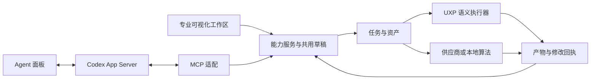

# 共用能力、状态与执行契约

更新：2026-09-20。这是 G01 待实现／校验的契约草案；示例对象和工具名不是当前已注册接口。

## 1. 调用关系

保留当前 Codex 会话适配和七个观察工具。新增 capability handler 同时供 UI HTTP 与 MCP 调用；不在两个入口中分别编译参数、发模型请求或操作 PS。

## 2. 最小对象

| 对象 | 必须表达的信息 | 生命周期与约束 |
|---|---|---|
| Asset | assetId、用途、内容校验值、mime、尺寸、色彩／位深、alpha／mask、来源与文件位置 | 原输入不可变；预览与生产输入分别标识；mask 不能用矩形冒充 |
| DocumentRef | 本次 PS 连接／运行期标识、documentId、可观察文档版本／状态、尺寸与来源 | documentId 重启后可能复用，不单独用它恢复写入；找不到同一来源时阻止回贴并保留结果 |
| EditContext | DocumentRef、baseAssetId、selectionMaskAssetId、参考图及用途、保持项、设置快照、输入适配变换 | 输入范围显式；补白、缩放、裁切保留可逆变换；写入前重新检查文档 |
| CapabilityDraft | draftId、capabilityId/version、revision、params、context、最后修改来源 | UI 与 Agent 读写同一 revision；过期更新返回冲突及新状态，避免互相覆盖 |
| Job | jobId、requestId、draft revision、不可变输入快照、父任务／子任务、供应商请求标识、状态、结果、错误和时间 | UI 请求去重；网络请求、PS 回贴和对话 turn 分开管理 |
| Result | resultId、assetId、jobId、候选序号、供应商信息及生成设置 | 可保留和重新回贴；回贴失败不丢图；返修派生新任务 |
| MutationReceipt | mutationId、jobId、源文档、创建层、修改原层前态、历史事务／检查点、回贴变换、后态、回滚状态 | 区分创建与修改；有后续用户编辑时检测冲突，禁止粗暴删除或倒退整个文档历史 |
| PhotoSetContext | 片单、角色／风格参考、样片、光线分组、阶段、反馈和认可版本 | 初期可以轻量记录；M3 扩充组图生产，不先做重型资产管理产品 |

M0 首先落实前七类；组图对象可在 M1 以轻量记录表达，不能阻塞首个真实样片。

## 3. 状态与重试

草稿与运行分离：运行某 revision 后，用户继续改参数会产生新 revision；已运行任务保持原快照。

建议分离生成与回贴状态：

- 执行状态：`queued → running → succeeded / failed / cancelled / recovery-required`。
- 回贴状态：`not-requested / queued / applying / applied / failed / rollback-conflict / rolled-back`。

供应商生成成功、回贴失败可以同时成立。停止 Codex turn 不自动取消 Job；取消 Job 不自动撤销已经完成的 PS 修改。UI 必须提供明确的取消任务和撤销修改语义。

持久化先写输入快照和 requestId，再执行副作用；回贴也有幂等标识和回执。断线后先核对已记录结果及文档状态。供应商不提供恢复查询时，标为 `recovery-required`，不能把一次不确定的网络结果当成可安全自动重试。

取消以 Job 为单位传播。对无法中断的供应商，停止等待与禁止自动回贴仍然生效；迟到结果只能以已取消任务的附属资产保留，不改变取消结论。

## 4. 能力接口

每项能力定义 `id/version/inputSchema/outputSchema/backendCapabilities/errors`，共享 handler 负责参数校验、状态读取／更新、运行和结果查询。专用工作区负责显示与编辑同一个 spec。

拟提供的能力族：能力发现、草稿读取／更新、生产抓图、参考资产、配方检索／装入、创建任务、状态／结果、取消、回贴、回滚。具体 MCP 名称在 G01 固定，避免本轮文档虚构接口已可用。

灯光 spec 包含灯具角色、位置／方向、颜色／色温、强度、目标与保持项；2D 灯层放置与生成式重打光声明不同后端限制。镜头 spec 描述视角意图，不宣称已有真实场景三维重建。示波器产生可计算统计，UI 和 Agent 读取同一结果。

## 5. 运行边界

- Photoshop 写入按实际宿主能力串行进入 modal；并行网络请求不代表可以并行写 PS。
- 在 modal 中检查 source document 与预期版本，检查 batchPlay 的错误描述符；失败恢复到本次操作前，不能以“未抛异常”认定成功。
- 长时间生成和跨重启恢复由持久化 Job 服务处理；现有短 bridge 内存队列继续只处理短宿主请求。
- 保留真实蒙版中的套索边缘、孔洞、透明度和羽化；生产像素尺寸、色彩与输入／输出适配要可追踪。
- UI／MCP 只引用受管理的资产与参数，密钥由供应商配置层管理，不进入普通任务事件、日志、配方或 Git。
- 当前专业页闭包 `lastCapture/lastResultLayerId/attachedRefs` 与服务端全局 `lastJob` 逐步迁出，不能给它们套 MCP 后继续作为共享任务真相。

## 6. 模块边界

以下是 G01 后的预定路径，均在 `apps/ls-studio/` 下：

| 模块 | 职责 |
|---|---|
| `companion/domain/` | 契约、schema、能力定义、错误和状态机 |
| `companion/assets/`、`companion/jobs/` | 资产、持久化任务、幂等、恢复、生命周期 |
| `companion/providers/` | BYOK 配置、模型能力、真实请求、解析、取消 |
| `companion/capabilities/` | 配方、原生编辑、生成与专用玩法的共享 handler |
| `companion/http/`、现有 MCP 适配文件 | UI 与 Agent 对同一能力的薄适配 |
| `plugin/ps-edit-014.js` 等宿主模块 | 生产抓图、蒙版、变更事务、回贴和回执 |
| `plugin/` 的工作区与任务视图 | 草稿、参数、上下文、进度、候选和人机接续 |
| `companion/skills/` | PS 指引及领域模块，能力与实现同步 |

入口 `server.js`、`plugin/index.html`、manifest 和根脚本由集成人统一管理。具体文件创建和归属在每次派发中固定；不允许多个 worker 同时改同一大文件后再靠覆盖解决。
