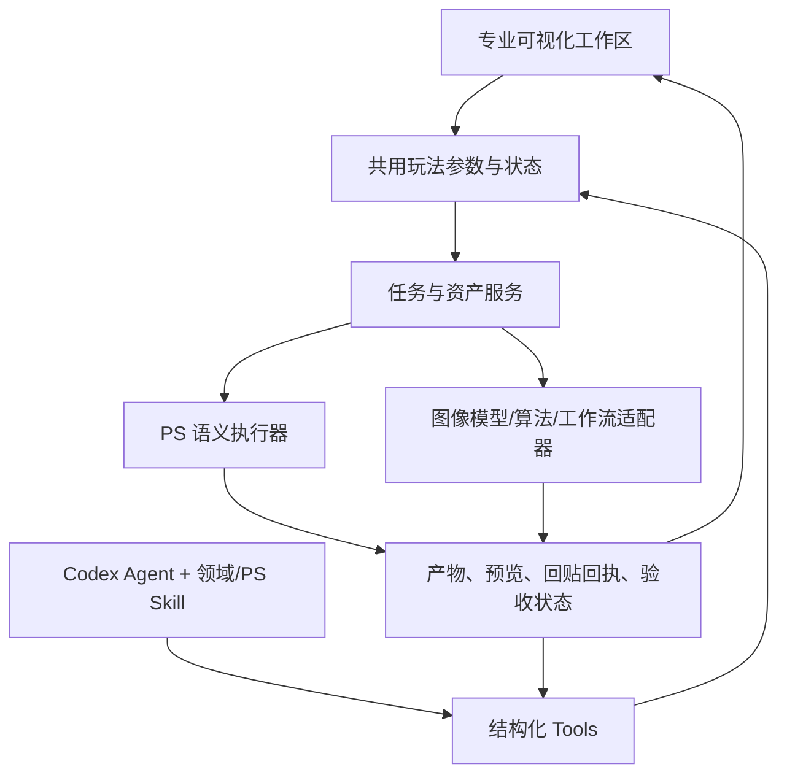

# Wheelchair → LS Studio：玩法、可视化与 Agent 能力对齐审计
> 2026-09-20 文档同步：本文保留原调研日期与实现边界。当前范围和排期以 [PRD](../PRD-LS-Studio.md)、[能力台账](../CAPABILITY-MATRIX.md) 和 [路线图](../ROADMAP.md) 为准。私人任务链接与本机证据路径改为来源标识；完整原始记录留在本机。

日期：2026-09-12。范围：当前 LS Studio 0.1.5 源码、轮椅 6.4.5 核心与本地 6.6.3 版本增量、相关 Codex 历史及旧交互原型。

本轮由主 agent 恢复规划，三个独立 agent 分别审计轮椅功能基准、当前专业界面与执行链、当前 Agent/MCP/Skill。除本报告外未修改产品代码，未调用真实图像供应商，未修改 Photoshop 文档。下文“已实现”是源码接线事实；真实验收另行注明。

## 1. 结论

用户当前目标是：轮椅中有价值的全部创作玩法，在 LS 中既可视化操作，也能通过结构化能力被插件 Agent 调用，并能在人与 Agent 之间接续同一个任务。

当前已完成真实 Codex 会话和 Photoshop 观察链路，但距离这个目标仍有大量业务能力缺口：

- 已有 7 个真实 PS MCP 工具：连接能力、文档、图层树、图层属性、选区边界、像素预览、选择已有图层。编辑／生成／回贴的正式 Agent 工具均为 0。
- 已有 121 份 `_isFactory: true` 配方，分布于 13 个 category。它们是提示词数据，不等于 121 个已执行的玩法或 121 个 Codex Skill。
- 专业页有配方检索、参数、参考图、抓图、部分原生动作、回贴与重跑代码，但生成恒为 mock，部分写入路径存在文档、蒙版与撤销缺陷。
- 灯光、人体剪影、镜头、半合成、场景、粒子、示波器、海报、多区拼接、分区、分块、节点画布、Forge、ComfyUI 等专用玩法，尚未进入当前 LS 的可视化与工具体系。
- 专业页与 Agent 页未共享配方、参考图、任务、产物和回贴状态。“送回 Agent”目前只是复制文字。

不以按钮数量、HTTP 路由数量、配方数量计算完成百分比。一个灯光工作区和一个目录按钮的工程量不同；有入口、代码可调用、真实结果通过验收也是三个不同状态。

## 2. 规划恢复：为什么现在看起来没有对齐

| 来源 | 已确认的用户方向／事实 | 与当前任务的关系 |
|---|---|---|
| 指定会话（本机历史记录） | 8 月 19 日明确区分 COS Skill、PS 操作 Skill、MCP/UXP 执行层；V2 先做提示词，V3 再做自主 PS 操作 | 双 Skill 是既有方向；当时轮椅是否作为执行依赖未决定 |
| 轮椅改版会话（本机历史记录） | 要求全功能可交互原型、BYOK、非商业；特别追问遗漏的灯光、半合成和可点击人体；要求保留高频操作、减少跳转 | 全玩法清单早已研究过，需恢复进当前产品路线 |
| LS review 会话（本机历史记录） | 9 月 7 日先接 Agent；9 月 12 日补真实 PS 观察，并要求按 COS 原片到发布考虑后续 | 解释了当前完成的是 Agent 与观察基础，而非全部业务模块 |
| 当时的 PRD 0.5（现由 [PRD 0.6](../PRD-LS-Studio.md) 替代） | 09-12 时以局部修图闭环为范围，曾排除 Forge、ComfyUI、复杂批量等；09-20 已恢复到 V2 分期目标 | 当前用户要求应成为新的全玩法目标；旧 Alpha 排除项应改为阶段安排，不能拿来抹去本次缺口 |
| 旧 V2 深度矩阵（来源 `WHEELCHAIR_LOCAL_6_6_3/prototype-white-glass-v2/DEEP_FEATURE_MATRIX.md:1`） | 已整理专用工作区、宿主动作、控件与手势、BYOK 分类 | 是可复用的需求资产，但其中部分“原型状态”为历史时点，需结合各节阅读 |
| 旧 V2 边界（来源 `WHEELCHAIR_LOCAL_6_6_3/prototype-white-glass-v2/VERSION_NOTES.md:1`） | 明确是交互原型，没有 Photoshop HostAPI 或远程生成连接 | 旧原型有灯光界面，不等于当前 UXP 插件已支持灯光 |
| V3 设计（来源 `LOCAL_COS_SKILL/references/photoshop-agent-design.md:1`） | 中立语义工具、文档版本、事务、回滚、双 Skill 分工 | 可以继续用作执行层设计依据 |
| [COS 原片到发布研究](Cosplay-RAW-to-Publish-Workflow.md) | 样片、精修／合成、整组统一、返修、排版、导出归档 | 全玩法覆盖以外，还要有实际生产流程与审美验收 |

旧 PXD 仓库 `PXD_LEGACY_CHECKOUT` 的 issue/PR 历史属于另一条代码线，不能计入此处完成度。当前下载目录没有 Git 元数据，本报告按文件快照审计。

历史要求中的广告、积分充值、作者账号、强制公告和遥测不属于需要恢复的创作玩法。BYOK 目标继续成立；本次功能对齐不要求复制这些模块。

## 3. 版本与统计口径

- 6.4.5 基准：`WHEELCHAIR_6_4_5`，静态解包快照。
- `WHEELCHAIR_LOCAL_6_4_5` 也是 6.4.5，但已有 MiniMax 适配修改，不能无条件当作原版。
- `WHEELCHAIR_LOCAL_6_6_3` 是后续本地版本，含新增玩法和自改代码；半合成等增量纳入本次目标，并与 6.4.5 核心区分。
- 旧矩阵记载 48 个磁贴入口、142 个动态 Host 动作、38 个额外路由命令、至少 159 个字面量发往 Host 的动作名。这些是历史源码扫描口径，不能相加成独立玩法总数，也不能作为本轮真机通过数。
- 当前 LS 实际入口是 `plugin/index.html` 中的 `*-014.js`。同目录无版本后缀的 `main.js`、`ps-return.js` 等不能作为当前主路径的覆盖证据。

## 4. 玩法对照矩阵

“缺”表示当前 LS 未找到该专用能力；“部分”表示存在入口／数据／局部实现，尚未形成该玩法的完整执行。Agent 栏指受支持的 Skill/tool 产品接口，不把模型可能通过任意 shell 请求旧 HTTP 路由算作支持。

下列按产品能力分组，存在底层依赖与交叉，不将行数作为原插件的功能总数。

| 编号 | 玩法／能力族 | 当前 LS 可视化与执行 | 当前 Agent | 需要补齐的关键点 |
|---|---|---|---|---|
| B01 | PS 文档、图层、当前画面观察与定位 | 已有对话工具结果及真实图片 | 7 个工具已接通 | 保留基础；生产抓图另建契约 |
| B02 | 选区抓图、恢复来源区域、明确整图输入 | 部分；当前主要要求选区，缓存有归属问题 | 可读边界／预览，无生产 capture tool | 真实 mask、源文档与版本、输入资产；整图须显式选择 |
| B03 | 多参考图、重抓／清除、参考用途归因 | 部分；最多 4 张，Agent 附件与专业 refs 独立 | 可看附件，无共用参考资产接口 | 底图／身份／服装／色调／特效来源表与共享 UI |
| B04 | 内置配方检索、装入、参数化 | 部分；121 份配方，检索最多 8 条，UI 仅前三个参数 | 无 recipe tools | 全参数 schema、分页／分类、配方自带 refs 接线 |
| B05 | 自定义预设编辑、复制、保存、导入导出、恢复 | 缺完整管理 | 缺 | 版本化 recipe 资源与 CRUD、导入检查 |
| B06 | 可点击人体剪影／17 部位导航 | 缺专用工作区 | 缺部位配方接口 | 部位→分类→配方映射；保持可视热区交互 |
| B07 | 提示词生成、反推、诊断、迭代、优化与翻译 | 部分；COS V2 知识已安装，专业编译仍为关键词规则 | COS Skill 可产出指令，无业务执行闭环 | 领域编译结果进入同一任务；优化／翻译遵循 BYOK |
| B08 | 真实图像编辑／生成式修图 | 有按钮与管线，实际恒回 mock PNG | 无生成 tool | 真供应商、真实输入／结果、错误和取消 |
| B09 | 纯文生图、数量与候选生成 | 当前 `/plan` 明确拒绝生成意图 | 无 | 在全玩法目标中单列生成模式与能力限制 |
| B10 | BYOK 供应商、模型能力、尺寸／质量／格式参数 | 图像供应商缺；Codex 对话模型设置已存在 | 无图像模型能力／生成接口 | 区分对话模型与图像模型，统一 provider adapter |
| B11 | 生成中心、候选切换、对比、手动回图、迟到结果 | 部分简化结果卡 | 无 result tools | 可追踪产物、完整状态、回贴失败可单独重试 |
| B12 | 历史搜索／重载／恢复选区／智能回贴／重跑 | 部分文字记录；重启后输入快照不完整 | Codex 会话可恢复，修图任务不可据此回放 | 持久化任务、资产、refs、参数与配方版本 |
| B13 | 智能对象／像素层、自动回贴／分组、蒙版／羽化 | 部分代码；开关未完整生效，蒙版缺陷 | 无 place/mask/group tools | 同一设置快照、写入事务、精确操作回执 |
| B14 | 批处理队列、逐项进度、停止、失败保留 | 缺；“允许批处理”不是执行器 | 缺 | batch jobs、并发限制、逐项取消／恢复 |
| B15 | 全局分区生成与蒙版回贴 | 缺 | 缺 | 分区规则、预览、共享提示词、子任务及合成 |
| B16 | 分块放大、tile/overlap、估算、测试填充 | 缺 | 缺 | 分块规划、接缝与一致性、可恢复任务图 |
| B17 | 多区拼接、跨文档来源、排布与分别回贴 | 缺 | 缺 | region 资产、变换、优先级、逆映射 |
| B18 | 创意幕布／节点流程、运行到此／全部、导入导出 | 缺 | 缺 | 同一 workflow graph 供画布编辑和 Agent 编排 |
| B19 | 2D 灯具定位、旋转、颜色／强度、灯层回贴 | 缺 | 缺 | 专用画布＋结构化灯具参数＋PS 放置 |
| B20 | 3D 多光源、角色／方位／高度／距离、光照生成 | 缺 | 缺 | 多灯场景 spec、可视预览、生成编译 |
| B21 | 3D 镜头、环绕／俯仰／距离／焦段、镜头描述 | 缺 | 缺 | camera spec 与图像编辑；不是 PS 原生真实三维重建 |
| B22 | 半合成／手办地台／垂悬环绕物 | 缺；6.6.3 玩法增量 | 缺 | 模式、兼容条件、丰富度、自动识别字段、生成 |
| B23 | 场景包、前中后景物品篮、灯光、镜头与人物参考 | 缺 | 缺 | scene spec、素材归因、空间与光色一致性 |
| B24 | 主辅粒子 VFX、混合、IOR／Fresnel／噪波／重力 | 缺专用玩法；现有 outerGlow 不等价 | 缺 | VFX spec、参数预览、批量和生成／图层组合 |
| B25 | AI 调色、参考图和混合模式 | 缺专用玩法；固定色相饱和原子不等价 | 缺 | grade spec、真实模型执行及混合回贴 |
| B26 | 小波精准色彩匹配／Reinhard 全局匹配 | 缺 | 缺 | 原生算法服务、源／参考资产、强度与验收 |
| B27 | Luma／RGB Parade／Vectorscope／Histogram 示波器 | 缺 | 缺 | 同一分析结果提供数值／图像，UI 绘图、Agent 读取 |
| B28 | 海报排版、多图素材池、多页、自动填表、逐页生成 | 缺 | 缺 | poster document、页与文字 schema、逐页产物与输出 |
| B29 | Forge img2img、模型／采样器／LoRA／ControlNet | 缺；旧 PRD 排除 | 缺 | 独立引擎 adapter 和动态能力表；全量范围下保留待办 |
| B30 | ComfyUI 工作流、动态参数、上传、进度／中断 | 缺；旧 PRD 排除 | 缺 | workflow adapter、参数 schema、任务与资产映射 |
| B31 | Photoshop Actions 录制、重复生成／加批／加参考 | 缺正式接线 | 缺 | 让 Actions／快捷命令调用共用业务入口 |
| B32 | Dock／快捷命令、自动回图／编组等设置 | 部分外观和开关；业务设置有空接线 | 缺业务状态接口 | 保留高频直达操作，所有参数真实影响执行 |
| B33 | 自动化任务边界、暂停、基线图层与生成层归属 | 真实 Codex 会话已有；编辑任务治理缺 | 仅当前有限工具约束 | job 级权限／取消／回滚，与 turn 生命周期分离 |
| B34 | 资源／缓存、预设同步、用量估算、诊断、可选遥控 | 部分服务日志；其余未形成共用产品能力 | 缺统一资源管理接口 | 本地／用户端点优先；低频能力作为可选扩展 |
| B35 | 自动补白凑方、返回裁白、原选区对齐／图像适配 | 缺完整路径 | 缺 | 可逆输入变换记录、返回逆变换；与自由 AI 扩图分开 |
| B36 | 多角色图像聊天、自定义角色、会话保存 | Codex 对话、附图与恢复已实现；未复刻角色编辑器 | 可对话、读取图像与用 Skill | 角色需求可用领域 Skill／配置承接；不据聊天可用认定业务自动化完成 |

特别纠偏：

1. 轮椅人体小人是预设部位导航，不是自动分割 PS 人体。LS 的模拟框脸属于另一个执行能力问题；自动选脸不能拿小人导航的存在作证明。
2. “肤质锁定”等提示词约束没有自动变成像素级保护。精确范围需要 mask 与执行保证；审美／身份保持还需要看图验收。
3. 6.6.3 场景包的图片模式在源码中仍标为开发中／disabled；文字配置模式有执行接线。前者不计作轮椅已完成能力。
4. 社区模拟调用／打赏、尚未接入的 Codex 展示区，不计作需要复制的真实编辑功能。
5. 抗截断、凑方、4K 偏色修复应抽象成输入适配／高分辨率输出与色彩稳定目标，再根据供应商能力选择实现；不要求照搬旧 hue-180 等补丁。

## 5. 当前代码中必须先处理的缺口

### P0：生成没有真实供应商

专业主路径固定 `provider: mock`；`/apply` 恒返回占位 PNG，两个 Banana 模块明确禁用 live。接入 Codex 对话模型不等于接通图像模型。

证据：server.js:698（LS Alpha `companion/server.js:698`）、main-014.js:657（LS Alpha `plugin/main-014.js:657`）、banana-live.js:2（LS Alpha `companion/banana-live.js:2`）、banana-generate.js:2（LS Alpha `companion/banana-generate.js:2`）。

### P0：专业 UI 与 Agent 没有共用任务

专业页使用闭包 `lastCapture/lastResultLayerId/loadedRecipeId/attachedRefs/taskRecords`；Companion 另有全局 `lastJob`；Agent 则维护独立会话与附件。送回 Agent 仅复制编译文字。

证据：main-014.js:46（LS Alpha `plugin/main-014.js:46`）、server.js:54（LS Alpha `companion/server.js:54`）、agent-014.js:269（LS Alpha `plugin/agent-014.js:269`）、main-014.js:2643（LS Alpha `plugin/main-014.js:2643`）。

`/atom/mask` 等路由只返回执行指示，实际写 PS 在旧 UI 内；只把这些 HTTP 包成 tool 不会得到完整执行与确认。server.js:967（LS Alpha `companion/server.js:967`）。

### P0：缓存没有正确隔离文档

缓存新旧只比较选区矩形，不比较 documentId。A 抓图后切 B，同坐标或无选区可能复用 A 图，并按缓存 docId 回贴 A。跨重启还恢复旧 docId。

证据：main-014.js:193（LS Alpha `plugin/main-014.js:193`）、main-014.js:232（LS Alpha `plugin/main-014.js:232`）、main-014.js:421（LS Alpha `plugin/main-014.js:421`）、main-014.js:540（LS Alpha `plugin/main-014.js:540`）。

### P0：回贴没有保留真实选区蒙版

抓图使用外接矩形且 `applyAlpha:false`；实际 `hostPs.return` 转发丢弃 `maskFromSelection`，回贴创建 `revealAll`。套索、孔洞、羽化边缘不受包围框保护。另一个备用回贴函数里有正确字样，不代表实际入口执行了它。

证据：ps-capture-014.js:238（LS Alpha `plugin/ps-capture-014.js:238`）、main-014.js:425（LS Alpha `plugin/main-014.js:425`）、ps-return-014.js:166（LS Alpha `plugin/ps-return-014.js:166`）。

### P0：撤销可能删除原有图层

无生成结果时，fx 会在已有底层加外发光；该层随后被记录为 `lastResultLayerId`。结果卡的“撤这层”统一删除该 ID，未区分任务新建层与任务修改的原有层。

证据：main-014.js:1227（LS Alpha `plugin/main-014.js:1227`）、main-014.js:2141（LS Alpha `plugin/main-014.js:2141`）、main-014.js:1761（LS Alpha `plugin/main-014.js:1761`）。这是静态可达路径发现，本轮没有对用户 PSD 复现删除。

### P1：可见参数和设置未全部控制执行

自动回贴、自动编组、读画笔开关只切换样式；主路径强制智能对象回贴。“覆盖”只有确认框；编译框编辑未同步执行；参数 UI 只展示前三项；配方内 refs 没有自动进入输入。

证据：main-014.js:2619（LS Alpha `plugin/main-014.js:2619`）、main-014.js:2088（LS Alpha `plugin/main-014.js:2088`）、main-014.js:2271（LS Alpha `plugin/main-014.js:2271`）、main-014.js:2477（LS Alpha `plugin/main-014.js:2477`）、main-014.js:2666（LS Alpha `plugin/main-014.js:2666`）。

### P1：历史记录不能可靠重跑

持久化记录没有保存原 capture、refs、参数／配方版本和产物；恢复时 capture 为 null，重跑可转用全局缓存。Agent 对话可恢复不能代替修图作业可恢复。

证据：main-014.js:560（LS Alpha `plugin/main-014.js:560`）、main-014.js:598（LS Alpha `plugin/main-014.js:598`）、main-014.js:761（LS Alpha `plugin/main-014.js:761`）。

## 6. 推荐抽象：一个玩法，两种操作入口

以下为设计建议，工具名是提议，不是当前已经注册的接口。

### 6.1 能力数据结构先统一

每个能力声明 `id/version/inputSchema/outputSchema/capabilities/errors`，UI 和 tool adapter 调同一个 handler。灯光／镜头等复杂交互保留专用工作区，基础参数表单可由 schema 驱动。不能把可视化等同于一排按钮，或把所有交互都压成通用表单。

关键对象：

- `Asset`：assetId、用途、源文档／图层／历史状态、尺寸、色彩信息、alpha、mask、文件位置。预览图与生产输入分开。
- `EditContext`：源文档与预期版本、底图、选区 mask、参考来源、editable/locked、任务设置快照。
- `Job`：jobId、能力版本、输入快照、参数、步骤／子任务、供应商请求标识、状态、取消、产物和回贴状态。
- `MutationReceipt`：源文档、新建层、修改原层的前态、历史事务、结果预览、接受／回滚状态。

现有 bridge 队列是短操作的内存队列，不能直接承担持续数分钟、跨重启恢复的生成／批处理系统。

### 6.2 Tool 与 Skill 的职责

| 层 | 应包含什么 | 示例 |
|---|---|---|
| 原子 tools | 真实、参数可校验的状态读取与执行 | capture、mask、adjustment、place、job status/cancel、rollback |
| 玩法接口 | 可序列化参数与可复用执行编排 | relight、hemisynth、stitch、tiled、poster、workflow |
| COS 领域 Skill | 角色／修图目标、阶段选择、保持项、参考归因、审美验收、返修判断 | 何时先换景、何时先精修、如何判断脸和光效是否合适 |
| PS 操作 Skill | 观察现场、选择真实工具、组织步骤、读回、恢复与回滚 | 如何将计划落实为选区、图层、蒙版和任务 |

保持两种 Skill 职责，具体玩法用按需加载的参考模块／工作流组织，不需要为 121 条预设写 121 个 Skill。COS V2 的提示词编译继续作为领域能力组件；它目前不会输出可执行的完整 PS 任务。

### 6.3 以灯光为例的双向接续

用户拖动主光位置、添加轮廓光，更新同一个 `RelightSpec`：灯具列表、角色、颜色／色温、强度、方位／高度、目标区域和保持项。Agent 读取该 spec 后可以把主光减弱并运行；UI 显示这次参数变化、任务进度和结果。用户再手动调色温时，也更新同一份 spec。

执行过程应能落为：读取现场 → 固定底图／mask → 编译灯光要求 → 生成 → 显示候选 → 回贴源文档 → 对比验收／撤销。2D 直接贴灯层和 3D 提示词生成可以共用灯光描述的部分字段，但必须声明不同后端的能力限制。

人体剪影的结构化对象是 `region + recipeId + params`；节点画布对应 workflow graph；半合成对应模式与字段；示波器对应可计算的图像统计。Agent 操作这些对象，UI 负责用合适的方式显示和编辑它们。

## 7. 建议推进顺序与完成定义

| 阶段 | 交付内容 | 通过条件 |
|---|---|---|
| P0 共用执行基础 | 文档／资产／任务契约；修复蒙版、缓存、撤销和设置；原生编辑 tools | 从 UI 与 Agent 调同一原生操作，结果可见、可定位、可精确撤销 |
| P1 首个完整玩法 | 配方＋参考图＋真实图像模型＋候选＋回贴＋历史 | 同一任务可在人与 Agent 之间接续；取消不回贴，回贴失败不重生成，重启重跑使用原输入 |
| P2 COS 高频专用工作区 | 人体部位、完整配方参数、灯光、半合成、调色／色彩匹配、VFX | 每个模块同时交付 UI、tools、Skill 使用说明和一个真实案例；不积累第二套执行逻辑 |
| P3 完整创作与批量 | 镜头、场景、拼接、分区、分块、批处理、海报、示波器 | 多任务可取消／恢复、逐项结果可追踪，参数与结果由 UI/Agent 共用 |
| P4 扩展引擎与流程 | 创意幕布、Forge、ComfyUI、Actions、可选扩展 | 同一资产与作业契约，动态能力发现，不再单独造一套任务系统 |

这是工程依赖和暂定顺序，不将后续阶段从全玩法目标里删除。具体 COS 高频模块的先后可由真实样片选择，但各模块应始终保留在这份清单。

单个玩法标记完成必须同时满足：

1. 用户可以直接进入、调整参数、看到当前上下文和状态。
2. Agent 可以发现能力、读取／修改相同参数并执行，不依赖模拟点击。
3. 真实输入得到真实结果；产物绑定任务与源文档。
4. 成功、失败、取消、回贴失败、重试有正确状态；写入可恢复。
5. UI 与 Agent 可以互相接续；恢复会话／重启不偷换输入。
6. 有真实 Photoshop／目标供应商案例证据，且视觉效果达到约定目标。

产品验收另用“一组 COS 原片→样片确认→精修／合成→整组统一→返修→发布稿”贯穿。轮椅功能对齐是工具覆盖标准，不能单独证明整组生产已经完成。RAW 显影、选片和归档可以与外部软件衔接，不应先声称已有 ACR/LR 自动化。

## 8. 验证与限制

- 本轮独立运行 `photoshop-bridge`、`photoshop-executor`、`agent-integration`、`agent-recovery` 四组现有测试，共 25 项通过。它们使用 fixture／fake host，验证协议、恢复和边界，不验证所有真实修图玩法。
- 已核对既有 PS 工具验证记录（公开摘要见 [验收基线](../VALIDATION.md)）及其引用的 live-verification.json（来源 `LOCAL_VALIDATION_ARCHIVE/ps-tools-integration/live-verification.json`）。七工具曾在 Photoshop 26、240×160 单层测试图中跑通，并验证会话恢复；不能外推为复杂 PSD、生产抓图或写入通过。
- 轮椅能力通过静态源码、事件与宿主执行路径确认，未运行其供应商请求或全部真机流程。原版也有占位与缺陷，不能将“源代码存在”写成全部玩法可靠。
- 本轮读取了相关历史用户消息与已有规划；历史消息中的临时动作授权不被当作本次修改产品或联系外部服务的指令。

## 9. 轮椅源码证据索引

以下是独立基准审计核实的 30 个功能族及代表路径，与上文矩阵按语义对应。每行的“真实”仅指存在 UI／handler／算法接线，不表示本轮执行过。B 为 6.4.5 静态基准，L 为本地 6.6.3-MiniMax。

| 原玩法族 | 当前矩阵 | 代表源码与已确认语义 |
|---|---|---|
| 1. 选区／整图编辑生成 | B02/B08/B10 | B runSingle（来源 `WHEELCHAIR_6_4_5/tiles/tile-run.host.js:308`），339 行复用抓图 |
| 2. 主图与参考图 | B03 | B captureRef（来源 `WHEELCHAIR_6_4_5/host/ps-io.js:1003`），1020/1039 行重抓；未找到独立“双图”编辑器，双图属于输入组合 |
| 3. 补白凑方／返回裁白 | B35 | B padToSquare（来源 `WHEELCHAIR_6_4_5/host/ps-io.js:477`），run host 365 行接线 |
| 4. 人体剪影 | B06 | B 部位定义（来源 `WHEELCHAIR_6_4_5/tiles/tile-bodypreset.js:18`），476 行颜色命中；17 类预设导航 |
| 5. 预设库 | B04/B05 | B 预设 handler（来源 `WHEELCHAIR_6_4_5/tiles/tile-presets.host.js:47`），222/372/395 行保存／导出／导入 |
| 6. 参数化提示词 | B04/B07 | B 参数解析（来源 `WHEELCHAIR_6_4_5/tiles/tile-prompt.js:718`），765 行填空、924 行记忆；还需保留或替换 `@param=0` 模块过滤语义 |
| 7. AI 提示词优化 | B07 | B promptOptimize（来源 `WHEELCHAIR_6_4_5/tiles/tile-prompt-optimizer.host.js:94`），112 行网络调用 |
| 8. 灯光 2D | B19 | B lightHandPlace（来源 `WHEELCHAIR_6_4_5/tiles/tile-lighthand.host.js:34`），灯光 UI 1061 行发送 |
| 9. 灯光 3D | B20 | B 多灯 prompt（来源 `WHEELCHAIR_6_4_5/tiles/tile-light.js:1711`），1718 行全场、509 行生成 |
| 10. 3D 镜头 | B21 | B 镜头参数编译（来源 `WHEELCHAIR_6_4_5/tiles/tile-camera.js:171`），387 行抓图、464 行生成 |
| 11. AI 调色 | B25 | B colorGradeTask（来源 `WHEELCHAIR_6_4_5/tiles/tile-colorgrade.host.js:44`），去色后重新上色并以颜色混合图层返回 |
| 12. 本地色彩匹配 | B26 | L Reinhard／小波（来源 `WHEELCHAIR_LOCAL_6_6_3/tiles/tile-colormatch.js:25`），96 行小波；6.6.3 增量，host 158/286 行手动／自动接线 |
| 13. 粒子特效 | B24 | B kaoVfxTask（来源 `WHEELCHAIR_6_4_5/tiles/tile-kao.host.js:14`），98 行附近真实模型调用；UI 25 行起有 11 项权重 |
| 14. 半合成 | B22 | L 半合成生成（来源 `WHEELCHAIR_LOCAL_6_6_3/tiles/tile-hemisynth.host.js:21`），6.6.3 增量 |
| 15. 手办地台／垂悬与自动识别 | B22 | L 三模式（来源 `WHEELCHAIR_LOCAL_6_6_3/tiles/tile-hemisynth.js:19`）、L 自动识别（来源 `WHEELCHAIR_LOCAL_6_6_3/tiles/tile-hemisynth.host.js:402`）；与半合成共用模块，三模式均需验收 |
| 16. 场景包 | B23 | B sceneGenerate（来源 `WHEELCHAIR_6_4_5/tiles/tile-scene.host.js:79`）；L 图片模式禁用（来源 `WHEELCHAIR_LOCAL_6_6_3/tiles/tile-scene.js:119`） |
| 17. 海报排版 | B28 | B posterGenerate（来源 `WHEELCHAIR_6_4_5/tiles/tile-poster.host.js:456`），906 行自动填表 |
| 18. 多区拼接 | B17 | B stitch handler（来源 `WHEELCHAIR_6_4_5/tiles/tile-stitch.host.js:26`），53/95 行生成／分别回贴；最多 6 区，可跨文档 |
| 19. 全局分区 | B15 | B startGlobalPartition（来源 `WHEELCHAIR_6_4_5/tiles/tile-partition.host.js:19`），49 行确认 |
| 20. 分块高清 | B16 | B tiled handler（来源 `WHEELCHAIR_6_4_5/tiles/tile-tiled.host.js:17`），320 行可视化填充测试；L tile 参数（来源 `WHEELCHAIR_LOCAL_6_6_3/tiles/tile-tiled.js:239`） 为 256–8192，226 行 overlap 0–1024 |
| 21. 批处理 | B14 | B batch handler（来源 `WHEELCHAIR_6_4_5/tiles/tile-batch.host.js:19`），45/84 行运行／队列 |
| 22. 创意幕布 | B18 | B canvasGenerate（来源 `WHEELCHAIR_6_4_5/tiles/tile-canvas.host.js:78`），97/152/164 行回 PS／导出／导入；L 节点菜单（来源 `WHEELCHAIR_LOCAL_6_6_3/tiles/tile-canvas.js:1766`） |
| 23. Forge | B09/B29 | B Forge host（来源 `WHEELCHAIR_6_4_5/tiles/tile-forge.host.js:175`），350 行 txt2img、495 行 interrupt；具体 UI 可达性须按版本逐项验收 |
| 24. ComfyUI | B30 | B 工作流执行（来源 `WHEELCHAIR_6_4_5/tiles/tile-comfyui.host.js:218`），105/418 行加载／中断；workflow-engine.js 127 行附近动态控件 |
| 25. 示波器 | B27 | B Luma 算法（来源 `WHEELCHAIR_6_4_5/tiles/tile-scope.js:262`），426/550 行 vector／histogram；scope host 69 行采样 |
| 26. 多角色 AI 助手 | B36 | L AI 聊天（来源 `WHEELCHAIR_LOCAL_6_6_3/tiles/tile-chat.js:317`），1099/1195 行角色选择／编辑 |
| 27. 任务中心 | B11/B14/B33 | B 回图状态（来源 `WHEELCHAIR_6_4_5/tiles/tile-tasks.host.js:22`），43 行手动返回；L center 792/823 行停止／回图 |
| 28. 历史／候选／回收 | B12/B34 | B 回收列表（来源 `WHEELCHAIR_6_4_5/tiles/tile-recyclebin.host.js:19`），69 行重贴；L records 320/996 行恢复选区／重贴 |
| 29. PS 返回策略 | B13/B35 | B 回贴蒙版（来源 `WHEELCHAIR_6_4_5/host/ps-io.js:917`），同一策略应被全部玩法复用 |
| 30. 自动化与动作录放 | B31/B33 | B automation dispatch（来源 `WHEELCHAIR_6_4_5/tiles/tile-automation.host.js:792`），668/683 行检查点／回滚；B Actions（来源 `WHEELCHAIR_6_4_5/host/recordable-actions.js:59`） |

支持项额外来源：B `tiles/tile-translate.host.js:121` 翻译；L `tiles/tile-sync.host.js:14` 预设同步；L `tiles/tile-netdoctor.host.js:71` 网络体检；L `tiles/tile-perftest.host.js:30` 回图性能测试。原实现中的代理服务、同步端点和布局机制可以替换，目标是保留用户能力。
